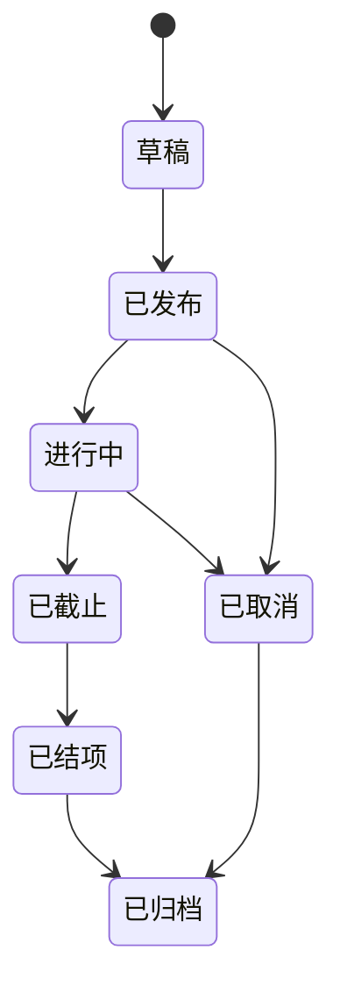
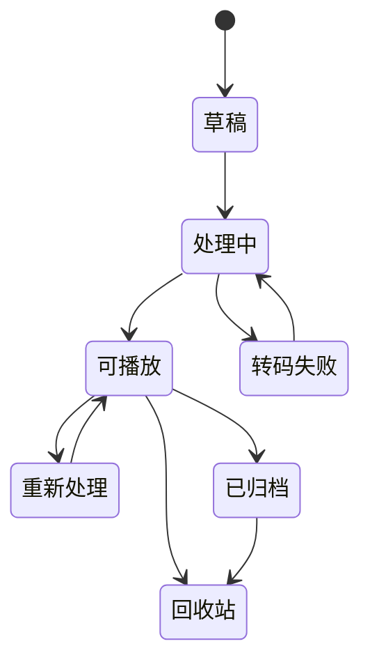
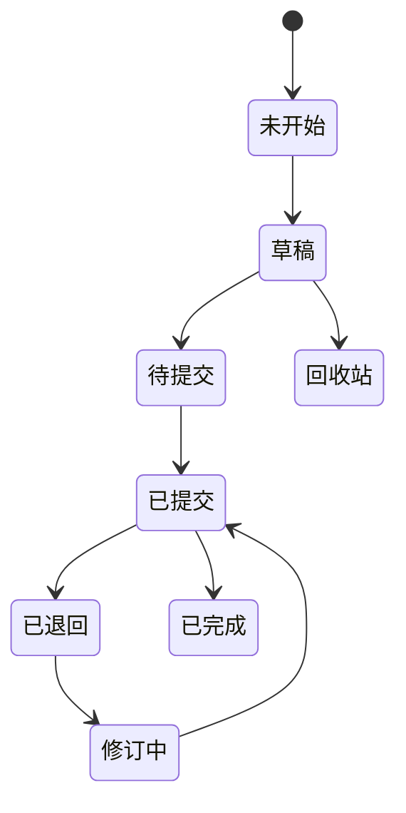
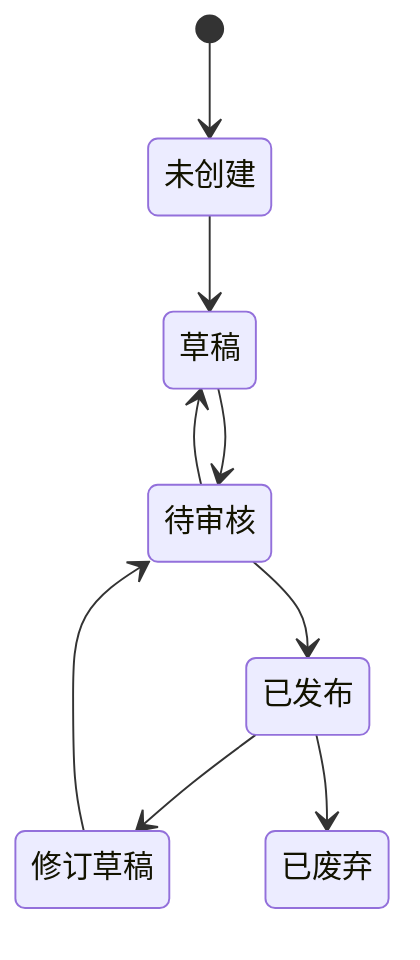
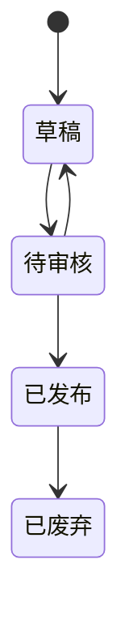
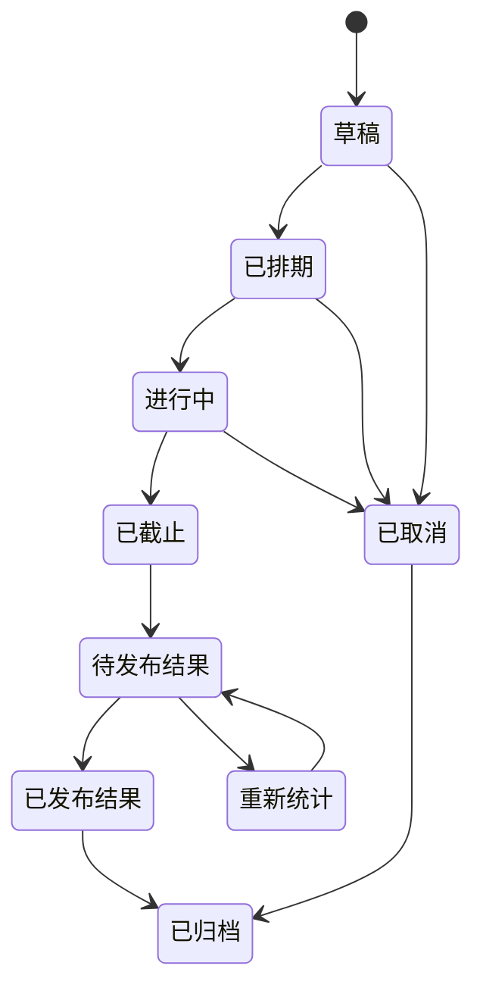
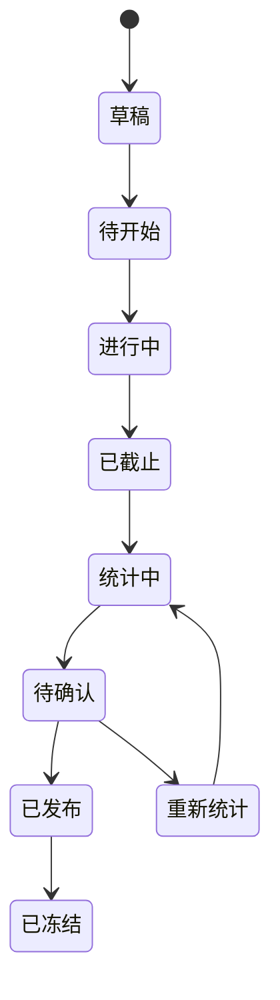
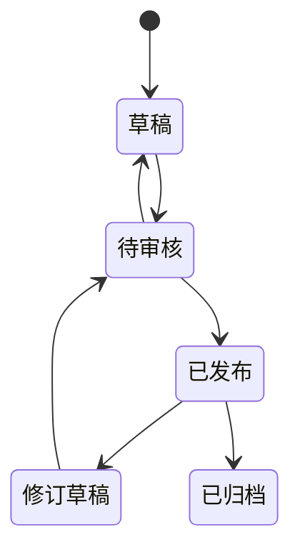

# 领域模型、权限与状态机

文档版本：V0.7  
平台架构基线：A0.1  
首个专业域：`AD_VIDEO`  
广告域标注体系基线：V0.2

本模型采用“公共外壳＋专业域强类型数据”。下文中的公共对象不得反向依赖广告视频对象；`AdVideoCase`、`Shot`、A1–A9和B1–B10均属于 `AD_VIDEO`。

## 1. 领域关系

```mermaid
erDiagram
    WORKSPACE ||--o{ MEMBERSHIP : has
    USER ||--o{ MEMBERSHIP : joins
    USER ||--|| WECOM_IDENTITY : authenticates
    USER }o--o{ DEPARTMENT_TAG : belongs
    PROFESSIONAL_DOMAIN ||--o{ ANALYSIS_SUBJECT : types
    WORKSPACE ||--o{ LEARNING_ASSIGNMENT : owns
    PROFESSIONAL_DOMAIN ||--o{ LEARNING_ASSIGNMENT : scopes
    LEARNING_ASSIGNMENT ||--o{ ASSIGNMENT_PARTICIPANT : assigns
    USER ||--o{ ASSIGNMENT_PARTICIPANT : receives
    WORKSPACE ||--o{ ANALYSIS_SUBJECT : contains
    ANALYSIS_SUBJECT ||--o| AD_VIDEO_CASE : extends
    AD_VIDEO_CASE ||--o{ MATERIAL_CONTRIBUTION : receives
    USER ||--o{ MATERIAL_CONTRIBUTION : contributes
    AD_VIDEO_CASE ||--o{ VIDEO_ASSET : stores
    AD_VIDEO_CASE ||--o{ CASE_METADATA_REVISION : revises
    AD_VIDEO_CASE ||--o{ CREATIVE_LEVEL_VOTE : receives
    USER ||--o{ CREATIVE_LEVEL_VOTE : casts
    AD_VIDEO_CASE ||--o| VIDEO_CREATIVE_SCORE : aggregates
    AD_VIDEO_CASE }o--o{ CASE_TAG : tagged
    ANALYSIS_SUBJECT ||--o{ ANNOTATION_TASK : creates
    LEARNING_ASSIGNMENT ||--o{ ANNOTATION_TASK : requires
    USER ||--o{ ANNOTATION_TASK : owns
    PROFESSIONAL_DOMAIN ||--o{ TAXONOMY_VERSION : defines
    ANNOTATION_TASK }o--|| TAXONOMY_VERSION : binds
    ANNOTATION_TASK ||--o{ ANNOTATION_SET : revises
    PROFESSIONAL_DOMAIN ||--o{ ANNOTATION_SET : scopes
    ANNOTATION_SET ||--o| AD_VIDEO_ANNOTATION_SET : extends
    AD_VIDEO_ANNOTATION_SET ||--o{ SHOT : contains
    AD_VIDEO_ANNOTATION_SET ||--o{ FIELD_ANSWER : contains
    ANNOTATION_SET ||--o{ ASSIGNMENT_SCORE : receives
    ANNOTATION_SET ||--o{ EXPERT_REVISION : refines
    FIELD_ANSWER ||--o{ ANSWER_SELECTION : selects
    FIELD_ANSWER ||--o{ EVIDENCE_REFERENCE : supports
    AD_VIDEO_CASE ||--o{ CASE_REACTION : receives
    FIELD_ANSWER ||--o{ FIELD_FEEDBACK : receives
    ANALYSIS_SUBJECT ||--o{ CONSENSUS_SET : resolves
    CONSENSUS_SET ||--o{ CONSENSUS_DECISION : contains
    LEARNING_ASSIGNMENT ||--o{ DISCUSSION_SELECTION : selects
    WORKSPACE ||--o{ EVALUATION_CAMPAIGN : owns
    EVALUATION_CAMPAIGN ||--o{ CAMPAIGN_CANDIDATE : contains
    ANNOTATION_SET ||--o{ CAMPAIGN_CANDIDATE : selected
    EVALUATION_CAMPAIGN ||--o{ CAMPAIGN_PARTICIPANT : assigns
    USER ||--o{ CAMPAIGN_PARTICIPANT : participates
    EVALUATION_CAMPAIGN ||--o{ EVALUATION_ROUND : stages
    EVALUATION_ROUND ||--o{ ROUND_CANDIDATE : qualifies
    CAMPAIGN_CANDIDATE ||--o{ ROUND_CANDIDATE : enters
    EVALUATION_ROUND ||--o{ REVIEW_ASSIGNMENT : distributes
    USER ||--o{ REVIEW_ASSIGNMENT : receives
    CAMPAIGN_CANDIDATE ||--o{ REVIEW_ASSIGNMENT : targets
    EVALUATION_CAMPAIGN |o--o{ ASSIGNMENT_SCORE : groups
    EVALUATION_ROUND |o--o{ ASSIGNMENT_SCORE : aggregates
    EVALUATION_CAMPAIGN ||--o{ CAMPAIGN_AWARD : grants
    ANALYSIS_SUBJECT ||--o{ CO_CREATION_SET : opens
    CO_CREATION_SET ||--o{ ANNOTATION_CONTRIBUTION : appends
    USER ||--o{ ANNOTATION_CONTRIBUTION : contributes
    ANNOTATION_CONTRIBUTION ||--o{ QUALITY_MARK : receives
    ANNOTATION_SET ||--o{ QUALITY_MARK : receives
    ANALYSIS_SUBJECT ||--o{ GOLD_STANDARD_SET : publishes
    GOLD_STANDARD_SET ||--o| CURATED_ANNOTATION_SET : renders
    GOLD_STANDARD_SET ||--o{ GOLD_STANDARD_SELECTION : composes
    ANSWER_LOCATOR ||--o{ CONSENSUS_DECISION : locates
    ANSWER_LOCATOR ||--o{ ANNOTATION_CONTRIBUTION : locates
    ANSWER_LOCATOR ||--o{ GOLD_STANDARD_SELECTION : locates
    ANSWER_LOCATOR ||--o{ DISAGREEMENT_RECORD : locates
    ANSWER_LOCATOR ||--o{ CONFIDENCE_ASSESSMENT : locates
    WORKSPACE ||--o{ BEHAVIOR_EVENT : records
    USER ||--o{ BEHAVIOR_EVENT : generates
    WORKSPACE ||--o{ ANALYTICS_SNAPSHOT : summarizes
    WORKSPACE ||--o{ DATA_EXPORT_JOB : exports
    USER ||--o{ DATA_EXPORT_JOB : requests
    USER ||--o{ SCORE_EVENT : generates
    USER ||--o{ REWARD_LEDGER : receives
```



### 1.1 依赖规则

```text
平台公共底座 ← 专业域接入契约 ← AD_VIDEO
```

- 公共层使用 `AnalysisSubject` 表达待逆向对象；
- `AdVideoCase` 使用与 `AnalysisSubject` 相同的主键进行强类型扩展；
- 公共层使用 `AnnotationSet` 表达答案修订；
- `AdVideoAnnotationSet` 扩展逐镜脚本和V0.2字段答案；
- 公共评审、共创、共识和金标准使用 `AnswerLocator` 定位答案位置；
- 平台公共模块不得导入 `AdVideoCase`、`Shot`、时间码或A/B字段定义。

## 2. 核心对象

### 2.1 身份与组织

| 对象 | 关键字段 |
|---|---|
| User | ID、姓名、头像、账号状态、企业微信成员ID |
| WeComIdentity | 企业微信主体、成员ID、授权信息、最后同步时间 |
| DepartmentTag | 企业微信部门ID、部门名称、层级路径、同步状态 |
| Workspace | 固定公司空间ID、名称 |
| Membership | 用户、工作空间、角色、加入时间、状态 |
| RoleAssignment | 角色、作用范围、授予人、有效期 |
| ProfessionalDomain | 专业域ID、稳定键、名称、状态、接入模块版本 |

MVP只登记 `AD_VIDEO`。`ProfessionalDomain` 是平台登记对象，不代表首版需要在普通用户界面提供专业域切换。

### 2.2 学习任务

| 对象 | 关键字段 |
|---|---|
| LearningAssignment | 标题、说明、主题、要求数量、截止时间、专业域、体系版本、工作流版本、评分量表版本、状态 |
| AssignmentParticipant | 用户、任务、完成目标、完成数、状态 |
| AnnotationTask | 逆向对象、用户、学习任务、专业域、体系版本、任务状态 |

一个学习任务可以要求每名成员提交一个或多个案例。案例可以由参与者新建，也可以引用已有案例，具体策略由任务配置决定。

### 2.3 逆向对象与广告视频案例

| 对象 | 关键字段 |
|---|---|
| AnalysisSubject | 标题、公司空间、专业域、域内对象类型、公共状态、创建人、可见范围 |
| AdVideoCase | 逆向对象ID、广告域案例状态、广告专业元数据 |
| MaterialContribution | 案例、贡献人、原始文件、提交时间、任务来源 |
| VideoAsset | 原文件、兼容播放副本、文件指纹、格式、大小、时长、处理状态 |
| CopyrightDeclaration | 声明类型、声明人、说明、凭证、处置状态 |
| CaseTag | 标签ID、名称、来源、状态 |
| CreativeLevelVote | 视频、投票人、奖级、换算分、修订号、状态 |
| VideoCreativeScore | 视频、平均综合分、展示奖级、有效票数、计算版本、更新时间 |
| CaseMetadataRevision | 视频、字段、修改前后值、管理员、原因、时间 |

`AnalysisSubject` 不包含视频文件、镜头或时间码。`AdVideoCase` 以共享主键扩展 `AnalysisSubject`。

同一个 `AdVideoCase` 可以有多个贡献人。重复提交优先新增 `MaterialContribution`，而不是复制整个案例。MVP不建立视频网址解析链路。面向用户的页面仍称“视频案例”。

### 2.4 标注

| 对象 | 关键字段 |
|---|---|
| AnnotationSet | 任务、逆向对象、用户、专业域、主体类型、体系版本、修订号、状态 |
| AdVideoAnnotationSet | 答案集ID、广告视频答案结构版本 |
| Shot | 稳定 ID、镜头组、显示序号、起止时间、13 列内容 |
| FieldAnswer | 字段编码、体系版本、结构补充、自定义值、依据、备注 |
| AnswerSelection | 选项 ID、选项名称快照、答案角色、顺序 |
| EvidenceReference | 字段答案、镜头 ID、时间段、说明 |
| SubmissionSnapshot | 提交时完整数据快照、提交人、提交时间、内容哈希 |
| AnswerLocator | 专业域、体系版本、位置类型、稳定位置键、显示名称快照 |

`AnnotationSet` 是平台公共答案外壳；`Shot`、`FieldAnswer`、`AnswerSelection` 和 `EvidenceReference` 均属于 `AD_VIDEO`，通过 `AdVideoAnnotationSet` 关联。

主体类型：

- `HUMAN_INDIVIDUAL`：个人标注；
- `TEAM_CONSENSUS`：团队共识；
- `ADMIN_REFINED`：管理员基于个人作业创建的精修版；
- `CURATED_BEST`：管理员组装并发布的最佳整体标注；
- `AI_SUGGESTION`：未来 AI 建议；
- `IMPORT_DRAFT`：Excel 导入但尚未确认的数据。

### 2.5 评价与反馈

| 对象 | 关键字段 |
|---|---|
| CaseReaction | 案例、用户、收藏／推荐类型 |
| RubricVersion | 专业域、评分量表版本、计分项、单项满分、评分指南、悬停提示内容、状态 |
| AssignmentScore | 作业修订、评分人、量表版本、逐项分、总分、批语、完整度、状态 |
| FieldFeedback | 字段答案、评价人、认同／质疑／建议修订、说明 |
| ReviewReply | 评价或反馈、回复人、内容 |
| ExpertRevision | 原个人作业、管理员、精修版本、修改说明、状态 |
| DiscussionSelection | 作业周期、候选作业、入选理由、讨论状态 |
| AdminQualityReview | 对象类型、对象ID、质量状态、审核人、问题、处置、时间 |
| ScoreModeration | 原评分、管理员、有效性、排除原因、汇总影响、时间 |

评分必须绑定具体作业修订和评分量表版本。标注产生新修订后，旧评分继续指向旧修订，不自动迁移。

视频创意奖级投票不绑定个人作业：

- `(video_case_id, voter_user_id)` 只能存在一条当前有效票；
- 奖级和值使用计算版本保存，MVP默认为大奖100、金80、银60、铜40、入围20；
- 改票产生新修订，旧修订退出有效聚合但继续可审计；
- `VideoCreativeScore` 可以重算，必须保存有效票数和计算版本；
- 创意综合分不能写入 `AssignmentScore`。

### 2.6 共识

| 对象 | 关键字段 |
|---|---|
| ConsensusSet | 逆向对象、专业域、体系版本、修订号、主持人、状态 |
| ConsensusParticipant | 参与共识的个人提交 |
| ConsensusDecision | 答案位置、结论、来源、理由、操作者 |
| ConsensusSnapshot | 发布时快照、内容哈希、发布时间 |

### 2.7 评选活动

| 对象 | 关键字段 |
|---|---|
| EvaluationCampaign | 标题、专业域、说明、开始结束时间、参与范围、工作流模板、量表版本、状态、发布人 |
| CampaignCandidate | 活动、作业提交快照、作者、显示顺序、冻结时间 |
| CampaignParticipant | 活动、用户、应评分数、已评分数、完成状态 |
| EvaluationRound | 活动、轮次号、开始结束时间、晋级规则、目标评分数、状态 |
| RoundCandidate | 轮次、候选、来源轮次、晋级分、状态 |
| ReviewAssignment | 轮次、评分人、候选、任务类型、权重、完成状态 |
| CampaignAward | 活动、奖项、候选、名次、确认人、发布时间 |
| CampaignResultSnapshot | 活动、候选统计、排名规则、发布时间、内容哈希 |

候选必须引用已提交的不可变修订。活动评分复用 `AssignmentScore`，增加可空的 `campaign_id`、`round_id`、`review_assignment_id` 和 `aggregation_weight`。同一参与者对同一候选在同一轮只有一份当前有效评分。

平台评审引擎只提供轮次、分配、权重、晋级、排名和奖项能力。首轮环形互评、`FREE_REVIEW`、严格 `> 80` 晋级和第二轮前两名获奖属于 `AD_VIDEO` 当前评选模板。

### 2.8 统计、体系、积分和审计

| 对象 | 关键字段 |
|---|---|
| PlatformWorkflowVersion | 平台提交、评审和审定流程版本 |
| TaxonomyVersion | 专业域、体系键、版本号、状态、内容哈希、发布记录 |
| TaxonomyField | 稳定字段 ID、编码、名称、问题、规则、答案结构 |
| TaxonomyOption | 稳定选项 ID、类别、名称、说明、状态 |
| ScoreEvent | 用户、指标、原始事件、分值、计算版本 |
| RewardLedger | 用户、奖励类型、数量、原因、状态、发放人 |
| BehaviorEvent | 用户、事件类型、对象、时间、来源页面、必要业务参数 |
| MetricDefinition | 指标编码、口径、聚合维度、计算版本 |
| AnalyticsSnapshot | 周期、指标、维度、样本数、结果、计算版本 |
| ExchangeContractVersion | 导出清单和SunOS交换协议版本 |
| DataExportJob | 导出人、专业域、用途、范围、体系／评分／交换版本、格式、文件、哈希、幂等标识、状态、审计信息 |
| AuditLog | 操作者、动作、对象、前后摘要、时间 |
| TrashEntry | 对象、删除人、删除时间、恢复期限、原父级 |

`BehaviorEvent`只记录明确的业务事件。登录、作业打开、保存、提交、评审、审定、导出和归档属于公共事件；播放、视频下载和创意投票属于 `AD_VIDEO` 事件扩展。它不记录连续鼠标轨迹、按键过程或未提交正文内容。后台指标必须绑定 `MetricDefinition` 计算版本。

当前 `TaxonomyVersion` 作为 `DomainSchemaVersion` 的既有实现名称。它必须绑定专业域，不再代表全平台只有一套标注标准。

### 2.9 共创与最佳整体标注

| 对象 | 关键字段 |
|---|---|
| CoCreationSet | 逆向对象、专业域、体系版本、状态、创建人 |
| AnnotationContribution | 共创集、答案位置、作者、正文、状态 |
| AdVideoContributionDetail | 共创贡献、候选标签、依据、时间码、镜头引用 |
| QualityMark | 被标记对象、答案位置、管理员、优秀原因、体系版本、推荐状态 |
| CuratedAnnotationSet | 金标准集、广告视频展示信息、修订号、发布状态、快照哈希 |

共创贡献为追加式记录。作者修改自己的贡献时产生新修订；删除进入回收站。优秀Mark不修改原对象。广告域允许贡献包含时间码和镜头引用；这些是专业域扩展，不是公共必填字段。

### 2.10 分歧、置信度与金标准

| 对象 | 关键字段 |
|---|---|
| DisagreementRecord | 逆向对象、专业域、体系版本、答案位置、涉及快照、差异类型、比较器版本、状态 |
| RevisionReason | 来源对象、答案位置、修改前后摘要、修改人、理由、证据、时间 |
| ConfidenceAssessment | 被判断对象、答案位置、判断主体、数值、量表版本、理由、时间 |
| GoldStandardSet | 逆向对象、专业域、体系版本、修订号、用途、审定人、状态、内容哈希 |
| GoldStandardSelection | 金标准集、答案位置、来源对象、来源修订、采纳内容、修改差异 |

金标准发布后不可就地修改。每个选择项必须指向原始答案、共识、共创、管理员精修或 `ADMIN_ORIGINAL`，并保留修订理由。`CuratedAnnotationSet` 是广告域“最佳整体标注”的专业展示扩展；原规划中的 `CuratedSelection` 统一映射为公共 `GoldStandardSelection`，不建立两套来源选择记录。

## 3. 数据隔离

### 3.1 个人标注

- 每个用户对每个任务拥有独立 `AnnotationTask`；
- 每次修订形成独立 `AnnotationSet` 或独立修订记录；
- 自动保存只能更新当前个人草稿；
- 其他用户不能编辑该草稿；
- 提交前仅作者和管理员可以查看该草稿；
- 提交后生成快照，任何修改必须创建新修订。

### 3.2 管理员精修

- 管理员可以基于任意个人作业创建 `ADMIN_REFINED` 数据集；
- 精修版引用原个人作业和具体修订；
- 原始个人作业保持不变；
- 精修过程记录字段和镜头级差异；
- 精修版可以发布为示范作业或共识候选。

### 3.3 AI 建议

- 使用独立主体类型和数据集；
- 记录模型版本、提示版本、运行参数和输入版本；
- 不直接写入个人标注；
- 用户接受 AI 建议时，个人结果记录引用来源；
- AI 不得直接发布共识。

MVP 不实现 AI 运行，仅预留数据边界。

### 3.4 团队共识

- 共识是独立 `ConsensusSet`；
- 共识绑定逆向对象、专业域和专业标准版本；
- 只引用已提交的个人标注；
- 不能覆盖或更改个人结果；
- 每项共识通过 `AnswerLocator` 记录采纳、合并或重写来源；
- 新共识修订不删除旧共识。

### 3.5 管理员质量治理

- 视频元数据和标签允许管理员直接修正，但每个字段产生 `CaseMetadataRevision`；
- 个人作业正文不以原作者身份覆盖，管理员修改产生 `ADMIN_REFINED` 校订版；
- 校订版可以被设为默认优质展示、示范作业、模板或共识候选；
- 原个人提交始终保留，并可比较修改前后差异；
- 管理员可以通过 `ScoreModeration` 将无效评分排除出汇总；
- 排除操作不物理删除原评分，必须记录原因和汇总变化；
- 数据质量状态与内容发布状态分开。

### 3.6 共创与最佳整体标注

- 共创集按逆向对象、专业域和标注体系版本隔离；
- 公司成员可以查看全部贡献并追加新贡献；
- 普通成员不能直接改写他人贡献；
- 作者修改自己的贡献产生新修订；
- 管理员优秀Mark是独立对象，不写入贡献正文；
- 最佳整体标注是独立版本集，不覆盖个人、共创、精修或共识；
- 发布时冻结来源列表、内容和体系版本；
- 新一版最佳整体标注不删除旧版。
- 在公共质量模型中，最佳整体标注对应 `AD_VIDEO` 的金标准专业视图；
- 分歧、修订理由和置信度独立存储，不回写原始答案。

### 3.7 公开范围

默认策略：

| 数据 | 本人 | 训练负责人 | 工作空间管理员 | 工作空间成员 | 只读成员 |
|---|---:|---:|---:|---:|---:|
| 个人草稿 | 是 | 否 | 是 | 否 | 否 |
| 个人已提交 | 是 | 是 | 是 | 是 | 是 |
| 历史提交修订 | 是 | 是 | 是 | 是 | 是 |
| 同行评分与批语 | 是 | 是 | 是 | 是 | 是 |
| 管理员精修版 | 是 | 是 | 是 | 是 | 是 |
| 共创贡献 | 是 | 是 | 是 | 是 | 是 |
| 优秀Mark | 是 | 是 | 是 | 是 | 是 |
| 最佳整体标注 | 是 | 是 | 是 | 是 | 是 |
| AI 建议 | 是 | 否 | 是 | 否 | 否 |
| 共识草稿 | 参与者 | 是 | 是 | 是 | 是 |
| 已发布共识 | 是 | 是 | 是 | 是 | 是 |

MVP只有一个内部公司空间，不设置敏感项目。普通成员可以查看全部视频和已提交作业，但不能查看他人的未提交草稿，也不能编辑他人的作业。

## 4. 权限矩阵

符号：查看 `R`、创建 `C`、编辑 `U`、删除到回收站 `D`、发布 `P`、管理 `M`。

| 对象 | 普通成员 | 训练负责人 | 体系管理员 | 工作空间管理员 | 只读成员 |
|---|---|---|---|---|---|
| 视频作品展台 | R | R | R | R | R |
| 全局公开内容搜索 | R | R | R | R | R |
| 视频创意奖级投票 | C；本人 U | C；本人 U | C；本人 U | M | R |
| 案例提交 | C、本人 U/D | C/U/D | C | M | - |
| 视频版权声明 | 本人 C/U | R/U | R | M | R |
| 训练任务 | R | C/U/D/P | R | M | R |
| 个人草稿 | 本人 C/U/D/R | 本人 C/U/D/R | 本人 C/U/D/R | M | - |
| 已提交个人标注 | R；本人新建修订 | R；退回 | R | M | R |
| 百分制评分与批语 | C；本人评分 U/D | C；本人评分 U/D | C；本人评分 U/D | M | R |
| 评选活动参与 | R/C评分 | R/C评分 | R/C评分 | M | R |
| 评选活动管理与结果发布 | - | - | - | M | - |
| 共创贡献 | R/C；本人 U/D | R/C；本人 U/D | R/C；本人 U/D | M | R |
| 优秀Mark | R | R | R | C/U/D/M | R |
| 最佳整体标注 | R | R | R | C/U/P/M | R |
| 管理员精修版 | R | R | R | C/U/P/M | R |
| 质量审核与评分处置 | - | - | - | M | - |
| 行为与评分统计后台 | - | - | - | M | - |
| 共识 | R | C/U/P | R | M | R |
| 体系草稿 | R | R | C/U | M | R |
| 体系发布 | R | - | P | M | R |
| 积分和奖励 | 本人 R | 建议／发放 | R | M | - |
| 视频文件下载 | R | R | R | M | R |
| 结构化数据导出 | - | - | - | M | - |
| 回收站 | 本人对象 R/恢复 | 项目范围 M | 体系范围 M | 全局 M | - |
| 审计日志 | 本人相关 | 项目范围 R | 体系范围 R | 全局 R | - |

管理员修改他人作业时不能使用原作者身份保存，必须创建管理员精修版并记录审计日志。

## 5. 状态机

### 5.1 训练任务



### 5.2 广告视频案例



原文件状态与兼容播放副本状态分开保存。无法在线预览时仍保留原文件，并允许公司成员下载。

### 5.3 个人标注



“已提交”表示产生快照；“已完成”表示任务层面完成，不代表个人数据被共识替换。

### 5.4 共识



### 5.5 标注体系



已发布体系不能返回草稿；需要修改时复制为新版本。

### 5.6 评选活动



活动进入“进行中”后，候选作业修订、参与范围和评分量表版本被冻结。管理员只能取消活动或在截止后排除无效评分并重新统计，不能静默替换候选。

### 5.7 评审轮次



首轮发布后，系统使用未四舍五入的综合分生成 `> 80` 晋级集合。第二轮评分任务优先排除该候选的首轮评分者。

### 5.8 最佳整体标注



已发布版本不可就地修改。新版本复制来源关系后再调整，并生成新的快照和内容哈希。

## 6. 并发与修订

- 草稿采用乐观锁，至少保存 `revision` 或 `updated_at`；
- 同一用户多端编辑发生冲突时，不静默覆盖；
- 提交操作使用幂等键；
- 快照保存内容哈希；
- 评分、管理员精修和共识引用不可变快照 ID，而不是“当前最新版”；
- 镜头使用稳定 UUID，排序变化不改变身份；
- 批量导入先进入暂存区，确认后事务性写入。
- 评选活动结果发布时保存统计快照和内容哈希；
- 无效评分处置后必须显式触发聚合重算，旧统计快照不覆盖。
- 环形互评任务生成使用幂等键，重复执行不得产生重复任务；
- 同一用户、同一轮、同一候选只有一份当前有效评分；
- 共创追加和优秀Mark创建均使用稳定目标位置ID。
- 公共评审、共识、共创和金标准统一使用版本化 `AnswerLocator`；
- 专业域和体系版本由不可变父对象唯一继承时，子对象不得接受调用方传入冲突值；
- 金标准发布保存内容哈希、来源清单和审定快照；
- 导出任务使用幂等标识，重复请求不得生成语义不同但标识相同的数据包。

## 7. 回收站

### 7.1 默认行为

- 删除只设置软删除标记并创建 `TrashEntry`；
- 被删除对象不在正常列表出现；
- 关联数据不立即级联物理删除；
- 恢复后回到原父级和原权限范围；
- 评分、管理员精修、积分和共识引用不因软删除失去审计关系。

### 7.2 永久删除

永久删除需要：

1. 管理员权限；
2. 明确对象和影响范围；
3. 二次确认；
4. 检查法律或审计保留要求；
5. 记录删除结果。

回收站默认保留30天。普通成员可以恢复自己删除且仍在保留期内的对象；管理员可以恢复权限范围内对象，并在审计约束下执行永久删除。

## 8. 审计事件

至少记录：

- 登录和关键权限变化；
- 专业域登记、启用、停用和接入模块版本变化；
- 企业微信登录、身份同步和部门标签变化；
- 案例创建、文件处理、版权状态变化；
- 视频上传、替换、禁用和下架；
- 标注提交、退回和修订；
- 百分制评分创建、修改、删除和举报；
- 视频创意奖级投票、改票和综合分重算；
- 管理员精修创建、发布和修订；
- 视频元数据和标签的管理员修正；
- 评分有效性处置和重算；
- 评选活动创建、候选冻结、发布、截止、统计和结果发布；
- 环形互评任务、自由补评、首轮晋级、第二轮评分和奖项发布；
- 共创贡献追加、修订、软删除；
- 优秀Mark创建、撤销和说明修改；
- 最佳整体标注组装、审核、发布和导出；
- 分歧生成、人工处置和比较器版本变化；
- 置信度创建、修改和量表版本变化；
- 金标准组装、审定、发布、废弃和导出；
- 行为指标与统计口径版本变化；
- 共识创建、决议、发布和修订；
- 平台工作流、专业体系、评分量表和交换协议的创建、审核、发布和废弃；
- 积分计算版本变化；
- 奖励发放、撤销和人工调整；
- 删除、恢复和永久删除；
- Excel 导入和管理员数据导出，包括专业域、用途、范围、全部适用版本、幂等标识和文件哈希。
