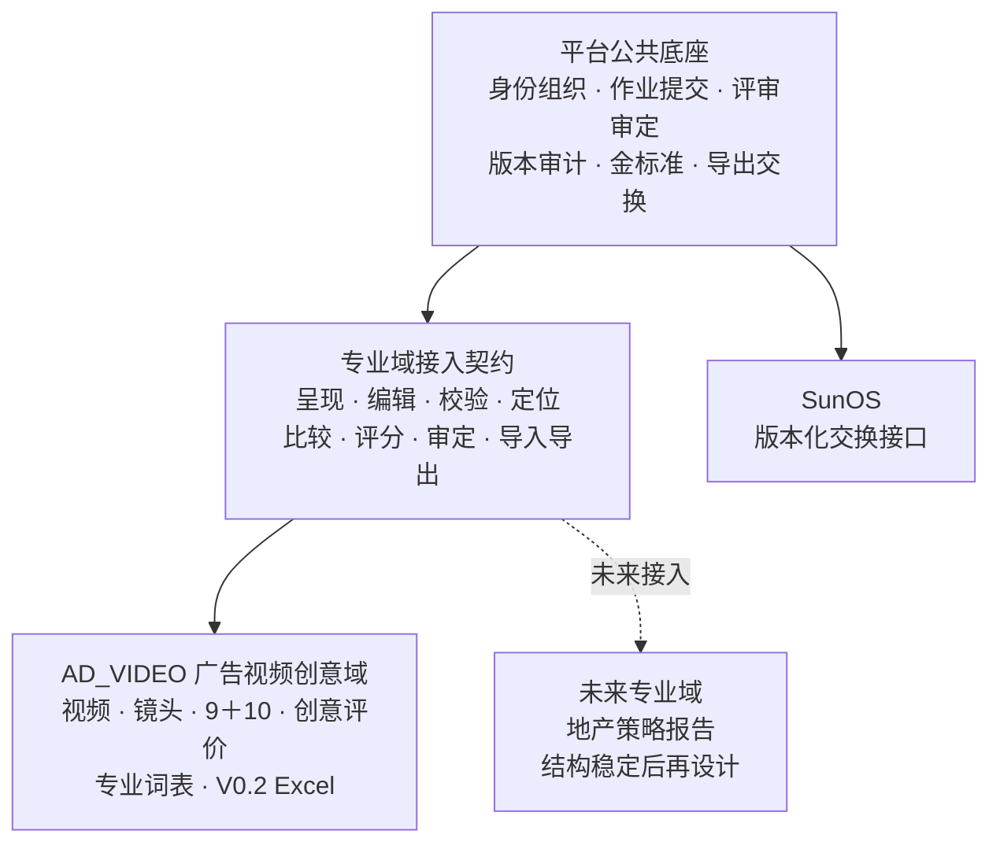

# 平台公共底座与专业域架构

架构版本：A0.1  
状态：已确认基线  
确认日期：2026-07-31  
首个专业域：`AD_VIDEO`（广告视频创意）

## 1. 上位定位

本产品的长期定位是：

> 一套专业逆向标注与能力训练平台的公共底座，加上可独立演进的专业域。

广告视频创意是第一个专业域。未来可以接入地产策略报告等其他专业域，但不同专业域的标注对象、答案结构、字段含义、评价标准和专业词表彼此独立。

平台公共底座负责：

- 用户、组织、角色与权限；
- 作业发布、参与、提交、修改与归档；
- 多人独立逆向、答案修订和不可变快照；
- 差异记录、集体评审、共创和最终审定；
- 标准版本、评分版本、修改记录和审计信息；
- 原始答案、分歧、修订理由、置信度和金标准数据；
- 数据导出任务及未来与 SunOS 的交换边界。

广告视频专业域负责：

- 视频素材、播放副本和版权声明；
- 逐镜脚本及时间码；
- 创意构成 A1–A9；
- 故事组织 B1–B10；
- 商业意图、创意思维链、镜头点评和全篇总结；
- 视频创意奖级投票；
- 广告专业评分量表、评分指南和专业词表；
- V0.2 Excel 的导入、导出和校验。

本次升格不改变广告视频专业域已经确认的字段含义、评分规则和页面体验。

## 2. 架构原则

### A-001 公共底座不依赖具体专业域

平台公共模块不得直接依赖视频、播放器、镜头、时间码、A/B字段、创意奖级或V0.2工作簿。

专业域可以依赖平台公共模块，并通过稳定契约接入作业、评审、审定、导出和审计能力。

### A-002 公共外壳与强类型专业数据并存

公共层保存对象身份、作业、答案修订、评审、审定、来源链和审计信息。

专业答案继续使用强类型数据结构。不得为了平台化而把广告视频的9＋10字段改成无语义键值，也不建设一张承载所有专业域的万能表。

### A-003 所有结果绑定专业域和版本

作业、答案、评分、共识、金标准和导出必须可以追溯到：

- 专业域；
- 专业域标注标准版本；
- 评分量表版本（适用时）；
- 平台工作流版本（适用时）；
- 导出／交换协议版本（发生交换时）。

### A-004 原始数据与治理结果隔离

个人答案、AI建议、管理员精修、团队共识、共创贡献和金标准分别保存。任何精修、审定或金标准组装都不能覆盖原始提交。

### A-005 平台引擎与专业策略分离

平台提供多轮评审、指定评分、自由补评、权重、阈值、排名和奖项能力。

环形互评、严格超过80分晋级、第二轮复评和前两名获奖，是 `AD_VIDEO` 当前使用的评选模板，不是所有专业域必须遵循的平台规则。

### A-006 不为未知专业域提前建模

地产策略报告的对象、字段、层级、评价标准和专业词表，等待其标注结构稳定后再设计。当前只保证接入边界存在，不实现地产域。

## 3. 模块边界



依赖方向必须保持为：

```text
平台公共底座 ← 专业域接入契约 ← 广告视频专业域
```

不允许出现：

```text
平台公共底座 → VideoCase／Shot／A1–B10
```

## 4. 公共核心对象

### 4.1 ProfessionalDomain

专业域登记对象。

| 字段 | 含义 |
|---|---|
| domain_id | 稳定ID |
| domain_key | 稳定命名空间；广告域为 `AD_VIDEO` |
| name | 专业域显示名称 |
| status | 草稿、启用、停用 |
| module_version | 当前接入模块版本 |
| created_at / updated_at | 审计时间 |

MVP仅登记 `AD_VIDEO`。当前普通用户界面不需要显示专业域切换器。

### 4.2 AnalysisSubject

平台统一的“待逆向对象”。

| 字段 | 含义 |
|---|---|
| subject_id | 公共对象ID |
| workspace_id | 所属公司空间 |
| domain_id | 所属专业域 |
| subject_type | 域内对象类型 |
| title | 公共标题 |
| status | 公共生命周期状态 |
| creator_user_id | 创建人 |
| visibility | 可见范围 |
| created_at / updated_at | 审计时间 |

广告域以共享主键方式扩展：

```text
AnalysisSubject
└── AdVideoCase(subject_id)
    ├── VideoAsset
    ├── MaterialContribution
    ├── CopyrightDeclaration
    └── AdVideoTag
```

页面文案仍可继续称“视频案例”，不要求用户理解 `AnalysisSubject`。

### 4.3 AnnotationTask 与 AnnotationSet

`AnnotationTask` 是公共作业实例，关联学习任务、逆向对象、作答人、专业域和适用标准版本。

`AnnotationSet` 是公共答案集／修订外壳，至少包含：

- 作业实例；
- 逆向对象；
- 作者；
- 专业域；
- 专业域标注标准版本；
- 修订号和状态；
- 来源类型；
- 创建、提交和归档时间；
- 内容哈希及不可变提交快照。

广告域答案使用强类型扩展：

```text
AnnotationSet
└── AdVideoAnnotationSet(annotation_set_id)
    ├── Shot
    ├── FieldAnswer
    ├── AnswerSelection
    └── EvidenceReference
```

`Shot` 和 `FieldAnswer` 不提升为平台公共对象。

### 4.4 AnswerLocator

公共流程需要引用答案中的某个稳定位置，但不解释该位置的专业含义。

| 字段 | 含义 |
|---|---|
| domain_id | 专业域 |
| schema_version_id | 专业标准版本 |
| locator_type | 答案位置类型 |
| locator_key | 稳定路径或稳定ID |
| display_snapshot | 当时的人类可读名称 |

广告域示例：

- `field/A3`
- `field/B7`
- `shot/{shot_uuid}/camera`
- `shot/{shot_uuid}/creative_comment`
- `summary/creative_chain`

未来专业域自行定义自己的定位符，平台不预设其章节和字段。

### 4.5 评审、共识与审定

以下能力归属公共平台：

- `EvaluationCampaign`
- `EvaluationRound`
- `ReviewAssignment`
- `AssignmentScore`
- `ConsensusSet`
- `ConsensusDecision`
- `CoCreationSet`
- `AnnotationContribution`
- `QualityMark`
- `GoldStandardSet`
- `GoldStandardSelection`

这些对象引用 `AnalysisSubject`、`AnnotationSet`、`SubmissionSnapshot` 或 `AnswerLocator`，不能直接引用 `VideoCase`、`Shot` 或 A/B 字段。

专业域负责：

- 怎样把两份答案规范化为可比较单元；
- 怎样判断某个位置的差异；
- 怎样呈现专业评分表；
- 怎样把已选择的答案单元组装为完整专业答案。

## 5. 数据质量与金标准

### 5.1 原始答案

个人提交和未来AI答案均保存原始快照。后续评分、精修、共识和金标准只引用原始快照，不修改其正文。

### 5.2 DisagreementRecord

用于显式记录多人答案之间的分歧：

- 专业域和标准版本；
- 逆向对象；
- 答案位置；
- 涉及的答案快照；
- 差异类型；
- 比较器版本；
- 状态及处理结果。

### 5.3 RevisionReason

管理员精修、共识改写和金标准调整必须记录：

- 修改前来源；
- 修改后内容；
- 修改人；
- 修改理由；
- 证据或讨论引用；
- 时间和审计事件。

### 5.4 ConfidenceAssessment

置信度是独立判断，不写入原答案正文。至少记录：

- 被判断对象或答案位置；
- 判断人或未来AI运行；
- 置信度数值；
- 量表定义及版本；
- 理由；
- 时间。

不同专业域可以使用不同置信度量表，跨域不得直接比较未归一化数值。

### 5.5 GoldStandardSet

金标准是经过明确审定、可用于训练或评估的版本化数据集。

其最低要求：

- 绑定专业域和专业标准版本；
- 绑定一个逆向对象；
- 每个采纳位置都能追溯原始答案或管理员原创；
- 保留分歧和修订理由；
- 记录审定人、状态、用途和内容哈希；
- 发布后不可就地修改，新调整产生新版本。

现有“最佳整体标注”作为 `AD_VIDEO` 的金标准组装方式继续存在。界面仍可使用“最佳整体标注”这一业务名称。

## 6. 四类版本

| 版本类型 | 负责内容 | 当前广告域示例 |
|---|---|---|
| PlatformWorkflowVersion | 提交、评审、审定等平台流程规则 | 后续实施时建立 |
| DomainSchemaVersion | 专业字段、选项、答案结构和校验规则 | V0.2 |
| RubricVersion | 计分项、分值、评分指南和聚合规则 | RUBRIC-V0.4 |
| ExchangeContractVersion | 导出清单、字段映射和交换协议 | 首次导出实现时建立 |

当前 `TaxonomyVersion` 视为 `DomainSchemaVersion` 的既有名称。实施时可以保留表名，但必须增加 `domain_id`，其语义不得继续被理解为全平台唯一标准。

所有已发布版本不可就地修改。修改必须复制产生新版本，并保留生效、废弃和迁移记录。

## 7. 专业域接入契约

当前只定义逻辑契约，不建设插件运行时或微服务。

每个专业域最终应提供：

1. `renderSubject`：呈现待逆向对象；
2. `renderSubmissionEditor`：呈现专业答案编辑器；
3. `validateSubmission`：按专业标准版本校验答案；
4. `normalizeAnswerUnits`：将答案转换为可定位的比较单元；
5. `compareSubmissions`：产生分歧记录；
6. `renderReview`：呈现专业评分和反馈界面；
7. `composeGoldStandard`：按来源组装金标准；
8. `importData / exportData`：执行专业格式导入导出；
9. `buildSearchDocument`：生成带专业域的搜索索引内容。

广告域可以继续使用专门设计的视频页面和逐镜编辑器。不得为了满足本契约而先建设通用动态表单页面。

## 8. 评审引擎与专业模板

公共评审引擎提供：

- 单轮或多轮活动；
- 候选快照冻结；
- 指定评委和自由补评；
- 评分权重；
- 晋级条件；
- 排名和并列处理；
- 奖项发布；
- 异常评分处置和结果重算。

`AD_VIDEO` 当前默认模板配置：

- 首轮环形互评；
- 完成指定评分后允许自由补评；
- 同行有效评分默认等权；
- 首轮未四舍五入综合分严格 `> 80` 晋级；
- 第二轮优先更换评分人；
- 第二轮前两名获得当次最佳作业奖。

其他专业域可以使用不同模板，不复制评审引擎。

## 9. 导出与 SunOS 交换边界

公共平台负责 `DataExportJob` 和交换清单；专业域负责生成具体业务文件。

交换清单至少包含：

- `export_id`
- `exchange_contract_version`
- `domain_id`
- `subject_id`
- 答案集及快照ID
- 专业标准版本
- 评分量表版本
- 来源、作者和修订链
- 分歧、修订理由和置信度
- 金标准状态及审定信息
- 版权、访问权限和是否包含原文件
- 文件清单、格式、哈希和生成时间
- 幂等标识

广告域MVP继续以V0.2 XLSX为主要专业导出格式，可按需要提供CSV或JSONL。SunOS当前只保留版本化交换边界，不开发实时同步和双向写入。

## 10. 搜索、统计和事件

公共搜索索引至少携带：

- `domain_id`
- `subject_type`
- `entity_type`
- `entity_id`
- 可见范围
- 专业标准版本

专业域负责产生可检索正文和专业标签。

公共行为事件包括登录、作业打开、保存、提交、评审、审定、导出和归档。播放、视频下载、创意奖级投票等是 `AD_VIDEO` 事件扩展，不应成为所有专业域必需字段。

## 11. 当前最小实施调整

在广告MVP核心数据表稳定前完成：

1. 建立 `ProfessionalDomain`，登记 `AD_VIDEO`；
2. 以 `AnalysisSubject` 承接公共流程，视频案例作为强类型扩展；
3. 使 `AnnotationTask`、`AnnotationSet` 和提交快照成为公共外壳；
4. 公共顶层对象记录或继承 `domain_id`；
5. 分开管理四类版本；
6. 公共评审、共创和审定改用通用答案定位；
7. 增加分歧、修订理由、置信度和金标准来源链；
8. 定义专业域接入契约和SunOS交换清单；
9. 将现有V0.2、百分制和两轮评审规则明确归属 `AD_VIDEO`；
10. 建立“公共模块不得引用广告域对象”的依赖检查规则。

如果子对象能够从不可变父对象唯一继承专业域，不要求机械地在每张子表重复保存 `domain_id`。

## 12. 延后事项

以下事项等待第二专业域结构稳定后处理：

- 地产策略报告的对象、字段、章节、答案和评分标准；
- 通用动态表单生成器；
- 地产专业比较器、评分页和审定页；
- 跨专业域统一词表和标签；
- 跨专业域评分归一化和排行榜；
- 面向普通用户的专业域切换器；
- 地产专业数据的具体存储结构；
- SunOS实时双向同步；
- 插件运行时、独立部署或微服务拆分；
- 将广告视频页面改造成通用专业域页面。

## 13. 广告域不回归验收

架构调整完成后，广告视频专业域必须继续满足：

1. V0.2的A1–A9、B1–B10定义和答案约束完全不变；
2. 用户仍从极简视频展台直接播放、看分析和进入作业；
3. 逐镜脚本、百分制作业、创意投票和两轮评审流程不变；
4. 个人答案、管理员精修、共识、共创和最佳整体标注继续隔离；
5. 所有答案和评分仍绑定明确版本；
6. 管理员仍可按V0.2导出，普通成员不能导出结构化数据；
7. 删除仍默认进入回收站；
8. MVP不出现空的地产入口，也不要求用户选择专业域；
9. 平台公共对象可以在不增加视频字段的情况下登记未来专业域；
10. 公共模块的接口和数据模型中不新增对视频、镜头或A/B字段的反向依赖。

## 14. 实施禁区

- 不得修改V0.2的9＋10字段含义；
- 不得把所有专业域答案塞入一张万能字段表；
- 不得复制用户、作业、评审、审计和导出系统来建设第二专业域；
- 不得在地产标准未知时预设其字段；
- 不得因平台升格暂停广告视频MVP；
- 不得在当前阶段提前建设插件市场、微服务体系或通用页面搭建器。
