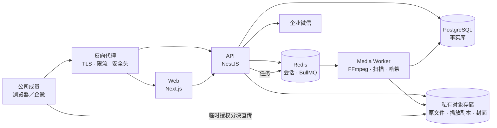
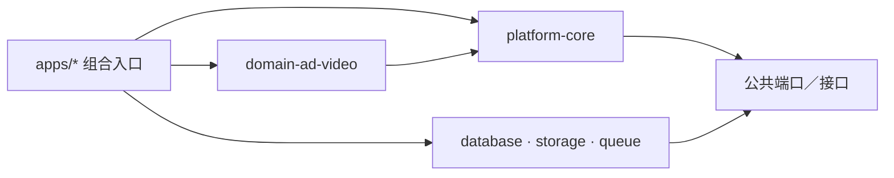
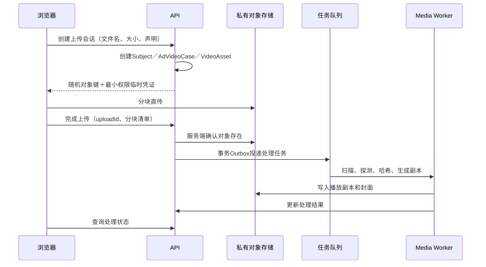

# 技术选型与阶段1工程设计

技术方案版本：T0.1  
状态：正式生产演进基线；演示纵切版已开始实施  
日期：2026-07-31  
适用范围：平台公共底座最小实现＋`AD_VIDEO` 阶段1  
前置架构：《平台公共底座与专业域架构》A0.1

## 1. 结论摘要

### 1.0 2026-07-31实施核查结论

T0.1适合作为正式内部生产系统的目标架构，尤其适用于企业微信身份、大文件分块直传、视频转码、多人评分、管理员导出和长期审计。

为了先交付“用一支视频完整演示上传、逆向标注和公开回看”的可用画面，首个演示纵切版采用更轻的同域全栈实现：

| 演示纵切版 | 正式生产演进 |
|---|---|
| Next.js／vinext同域页面与API | Next.js页面＋NestJS业务API |
| D1关系数据 | PostgreSQL事实库 |
| R2原始视频对象 | 私有COS及播放副本 |
| 工作区身份头；本地使用演示身份 | 企业微信OAuth及部门同步 |
| 浏览器兼容格式直接播放 | Worker探测、扫描和H.264播放副本 |
| 单机／工作区部署 | 容器化生产部署 |

这不是推翻T0.1，而是把第一阶段拆成一个先可演示、再生产化的纵向切片。现有演示代码已经保留以下迁移边界：

- 视频对象与标注对象分离；
- 每份作业绑定`AD_VIDEO`和`V0.2`；
- 草稿使用递增修订号；
- 提交生成不可变快照和内容哈希；
- 原始作业与公开快照不相互覆盖；
- 删除进入软删除状态；
- 视频文件与关系数据分别存储。

在接入企业微信、真实大文件和首次多人评审前，再进入T0.1的PostgreSQL、对象存储直传及异步视频处理改造；本轮不为未来地产专业域增加具体字段。

阶段1采用：

> TypeScript模块化单体、前后端分进程、视频处理独立工作进程、单一PostgreSQL事实库、私有对象存储直传。

这不是微服务架构。代码在一个仓库、一个发布版本和一个主数据库中管理，但通过模块和进程边界隔离用户请求、专业业务和耗时视频处理。

| 领域 | 建议选择 | 阶段1结论 |
|---|---|---|
| Web | Next.js App Router＋TypeScript | 采用 |
| API | NestJS REST API＋OpenAPI | 采用 |
| 数据库 | PostgreSQL 16+稳定版本 | 采用 |
| ORM／迁移 | Prisma ORM，多Schema | 采用 |
| 后台任务 | BullMQ＋Redis | 采用 |
| 对象存储 | S3兼容抽象；生产优先腾讯云COS | 采用 |
| 视频处理 | 独立容器中的FFmpeg／ffprobe | 采用 |
| 在线播放 | 阶段1生成H.264＋AAC MP4播放副本 | 采用 |
| 登录 | 企业微信OAuth适配器＋服务端会话 | 采用 |
| 前端数据 | REST客户端＋服务端渲染；编辑页客户端状态 | 采用 |
| 搜索 | 阶段1使用PostgreSQL基础查询 | 采用 |
| 可观测性 | 结构化日志＋OpenTelemetry Trace／Metric | 采用 |
| 部署 | Docker容器；生产使用托管数据库、Redis和对象存储 | 采用 |
| Kubernetes | 不引入 | 延后 |
| 微服务 | 不拆分 | 延后 |
| 通用动态表单 | 不建设 | 延后 |

具体依赖版本在建立代码仓库时锁定到当日稳定版本，并提交锁文件；生产构建不得使用无边界的 `latest`。

## 2. 选择理由

### 2.1 为什么是模块化单体

当前系统的复杂度主要来自：

- 多人答案与不可变修订；
- 标注标准和评分标准版本；
- 视频大文件上传及异步处理；
- 权限、审计和回收站；
- 未来专业域隔离。

这些问题需要清晰模块边界，但当前用户规模和团队协作场景不需要微服务的独立部署、分布式事务和复杂运维。

模块化单体可以做到：

- 一次提交完成跨模块事务；
- 一套迁移管理公共表和广告域表；
- 通过代码依赖规则保证公共层不依赖广告域；
- 视频处理按进程独立扩容；
- 第二专业域稳定后再增加专业模块。

### 2.2 为什么Web和API分进程

Next.js负责：

- 视频展台和页面渲染；
- 路由、布局和响应式体验；
- 播放器、上传器及长表单交互。

NestJS负责：

- 企业微信身份和会话；
- 权限、版本和业务规则；
- 作业、修订、提交和审计；
- 对象存储临时授权；
- OpenAPI契约和后台任务生产。

所有写操作进入NestJS API。Next.js不在Server Action中重复实现业务规则。

这样既保留Next.js的页面能力，又避免未来专业域逻辑散落在页面路由中。

### 2.3 为什么使用PostgreSQL

本系统的核心是强关系、强版本和强审计数据。作业、答案快照、评分、来源链和回收站需要事务与外键保障。

PostgreSQL用于：

- 事实数据和关系约束；
- 乐观锁修订号；
- 不可变快照元数据；
- 事务性Outbox；
- 基础文本筛选；
- 审计和回收站。

`jsonb`只用于不可变快照、供应商返回元数据和少量扩展参数，不用于替代广告域的镜头及V0.2强类型答案表。

### 2.4 为什么暂不建设搜索服务

全局搜索在阶段2交付。阶段1仅需要视频展台、标题／标签基础查询和个人作业定位。

先使用PostgreSQL规范化文本、普通索引和必要的模糊匹配。等积累真实中文搜索数据后，再决定是否引入独立搜索服务，避免在没有语料和规模前维护Elasticsearch／OpenSearch。

## 3. 运行架构



关键约束：

- 浏览器上传文件时不经过Web或API服务器；
- 对象存储默认私有，播放和下载均需短时授权；
- API不执行转码、扫描或大文件哈希；
- Worker进程失败不影响登录、浏览和编辑；
- PostgreSQL是业务状态事实源，Redis不是最终审计数据源。

## 4. 仓库与模块结构

建议使用 `pnpm workspace` 单仓库：

```text
apps/
├── web/                    # Next.js用户站与管理员页面壳
├── api/                    # NestJS REST API
└── worker/                 # 视频扫描、探测、转码和哈希
packages/
├── platform-core/          # 公共领域对象和业务规则
├── domain-ad-video/        # 广告视频专业规则
├── api-contracts/          # API DTO、OpenAPI生成和错误码
├── database/               # Prisma模型、迁移和仓储实现
├── storage/                # COS／MinIO适配器
├── observability/          # 日志、Trace和Metric
├── ui/                     # 公共视觉原语
└── test-fixtures/          # V0.2与视频测试夹具
```

依赖方向：



工程规则：

- `platform-core`不能导入 `domain-ad-video`；
- 公共API DTO不得出现镜头列、时间码或A/B字段；
- `domain-ad-video`通过公共仓储接口使用任务、提交、版本和审计；
- Prisma生成类型不得直接成为公共领域接口；
- 使用依赖检查和Lint规则阻止反向引用；
- 第二专业域只增加新的域包和专业页面，不复制公共API模块。

## 5. 数据库组织

同一个PostgreSQL实例使用命名Schema：

| Schema | 内容 |
|---|---|
| `core` | 用户、组织、专业域、逆向对象、任务、答案外壳、版本、回收站 |
| `ad_video` | 视频案例、素材、视频资产、逐镜、9＋10答案及专业扩展 |
| `review` | 评分、评选、共识、共创、分歧、置信度和金标准 |
| `audit` | 审计日志、Outbox、幂等记录、导出记录 |

Prisma负责类型安全访问和迁移。数据库约束仍是最终防线，不能只依赖应用校验。

### 5.1 阶段1必须建立的公共表

- `professional_domains`
- `workspaces`
- `users`
- `wecom_identities`
- `department_tags`
- `user_department_tags`
- `memberships`
- `role_assignments`
- `analysis_subjects`
- `learning_assignments`
- `assignment_participants`
- `annotation_tasks`
- `annotation_sets`
- `submission_snapshots`
- `platform_workflow_versions`
- `taxonomy_versions`
- `rubric_versions`
- `exchange_contract_versions`
- `audit_logs`
- `trash_entries`
- `idempotency_keys`
- `outbox_events`

### 5.2 阶段1必须建立的广告域表

- `ad_video_cases`
- `material_contributions`
- `video_assets`
- `video_upload_sessions`
- `video_processing_jobs`
- `copyright_declarations`
- `ad_video_annotation_sets`
- `shots`
- `field_answers`
- `answer_selections`
- `evidence_references`

### 5.3 约束原则

- 所有主键使用服务端生成的稳定UUID；
- 所有时间以UTC保存，界面按Asia/Shanghai显示；
- `AnnotationSet`必须与任务、逆向对象、专业域和体系版本一致；
- `AdVideoCase.subject_id`同时是指向 `AnalysisSubject` 的主键和外键；
- `AdVideoAnnotationSet.annotation_set_id`同时是主键和外键；
- 已发布标准版本不得更新正文；
- 提交快照只新增，不更新；
- 草稿使用递增 `revision` 乐观锁；
- 软删除对象保存 `deleted_at`，并创建 `TrashEntry`；
- 审计日志只追加；
- 活跃状态使用必要的唯一索引，防止重复有效记录。

## 6. V0.2标准初始化

阶段1初始化时：

1. 登记专业域 `AD_VIDEO`；
2. 登记V0.2为已发布 `TaxonomyVersion`；
3. 保存权威Excel文件SHA-256；
4. 根据数据字典建立A1–A9、B1–B10及稳定选项ID；
5. 登记 `RUBRIC-V0.4`，但阶段1不开放正式互评分配；
6. 建立首个工作流版本和交换协议占位版本；
7. 运行字段数、选项数、角色和级联关系校验。

数据库种子只来源于V0.2权威表和已经确认的数据字典。种子脚本不得从页面文案反推字段定义。

## 7. 企业微信身份与权限

### 7.1 登录

生产环境只提供企业微信身份登录：

1. 用户发起登录；
2. 服务端生成带过期时间的 `state` 和 `nonce`；
3. 跳转企业微信官方授权流程；
4. 回调后由服务端换取成员身份；
5. 使用 `(corp_id, wecom_user_id)` 查找或创建用户；
6. 同步姓名、头像和部门标签；
7. 创建服务端会话，浏览器只保存 `HttpOnly`、`Secure`、`SameSite` Cookie。

不把企业微信Secret下发到浏览器，不以姓名或手机号作为稳定主键。

本地开发和自动化测试允许使用开发身份适配器，但生产构建必须拒绝启用该适配器。

### 7.2 权限

权限判断统一经过API守卫：

- 工作空间成员身份；
- 当前账号状态；
- 角色与能力；
- 数据所有者；
- 对象状态；
- 专业域；
- 是否已提交／已发布。

前端隐藏按钮只是体验处理，不能代替服务端鉴权。

阶段1先实现：

- 普通成员；
- 训练负责人；
- 体系管理员；
- 工作空间管理员；
- 只读成员。

权限以能力键表达，例如 `assignment.publish`、`submission.read_all`、`video.download`、`taxonomy.publish`，避免在业务代码中散落角色名称判断。

## 8. 视频上传与处理

### 8.1 上传“不限”的工程解释

“格式、大小、时长不限”是上传侧业务规则：

- 页面不设置任意的小文件上限；
- 不因文件扩展名拒绝保存原文件；
- 普通成员通过鉴权播放接口站内观看，不提供原片下载接口或页面入口。

底层供应商和浏览器仍存在客观限制。系统必须使用分块上传、动态分块大小、清晰错误和可恢复流程，而不能承诺任何设备都能播放任何编码。

### 8.2 上传流程



上传会话保存：

- 资产ID；
- 对象存储供应商；
- 随机对象键；
- `upload_id`；
- 文件名、声明大小和浏览器MIME；
- 已确认分块；
- 创建人、过期时间和状态；
- 完成请求幂等键。

浏览器本地使用IndexedDB保存续传检查点。服务端以对象存储的已上传分块为准，本地记录仅用于恢复界面。

### 8.3 分块策略

- 默认分块建议16MiB；
- 根据文件大小动态增大分块，保证总块数低于供应商上限并预留重试空间；
- 同时上传的分块数可配置，默认3；
- 临时授权只允许写入当前随机对象键；
- 浏览器不得获得列举存储桶、读取其他对象或删除对象的权限；
- 未完成上传会话定期过期并终止残留分块。

生产优先使用腾讯云COS高级分块上传和临时密钥；本地开发使用MinIO实现同一存储接口。

### 8.4 处理状态机

```text
CREATED
  → UPLOADING
  → UPLOADED
  → QUARANTINED
  → SCANNING
      → BLOCKED
      → SAFE
  → PROBING
  → PROCESSING
      → READY
      → PROCESSING_FAILED
```

规则：

- `BLOCKED` 文件不能播放，管理员可以查看处置原因；
- `SAFE` 后才允许生成和访问站内播放副本；
- 转码失败不删除安全原文件；
- 所有重试创建处理尝试记录，不覆盖失败原因；
- 处理任务必须幂等，相同资产和处理版本不得生成冲突副本。

### 8.5 阶段1播放副本

阶段1标准输出：

- MP4容器；
- H.264视频；
- AAC音频；
- Web优化的 `faststart`；
- 一张封面图；
- 保留原始宽高比；
- 不放大低分辨率源文件。

已兼容源文件可以优先Remux；其他可解码文件转码。阶段1不生成多码率HLS，等真实长视频、网络和带宽数据证明有必要后再增加。

播放器使用HTML5 Video，支持Range请求和播放错误反馈。播放地址短时有效，响应使用inline语义；普通成员请求下载模式时服务端返回403。由于网页播放必然向浏览器传输媒体字节，本方案不承诺DRM级防复制。

### 8.6 安全隔离

- 原文件进入隔离状态，未扫描前不对成员开放；
- 文件安全扫描通过可替换的 `FileScanner` 接口执行；
- FFmpeg／ffprobe运行在非root、有限CPU／内存、有限临时空间的独立容器；
- 处理容器默认无访问业务内网和公网的权限；
- 用户文件名不参与真实对象键和命令拼接；
- 所有外部进程使用参数数组，不执行拼接后的Shell命令；
- 处理日志清除临时凭证和敏感路径。

## 9. 后台任务可靠性

BullMQ和Redis负责调度，不作为唯一业务记录。

PostgreSQL中的 `video_processing_jobs` 保存：

- 任务类型和处理版本；
- 资产；
- 当前状态和进度；
- 尝试次数；
- Worker标识和心跳；
- 错误分类及摘要；
- 输出文件引用；
- 开始、结束和重试时间。

API在业务事务中写 `outbox_events`。单独分发器把Outbox事件发送到BullMQ，成功后标记已投递，避免“数据库已提交但队列未收到”的双写问题。

任务采用：

- 稳定Job ID；
- 明确超时；
- 有限次数重试；
- 指数退避和抖动；
- 失败任务保留；
- 管理员手动重放；
- 幂等输出键。

视频CPU任务由独立Worker进程执行，不能阻塞API的Node.js事件循环。

## 10. API契约

### 10.1 形式

- REST；
- 基础路径 `/api/v1`；
- OpenAPI作为前后端契约；
- JSON使用UTF-8；
- 上传内容不经过REST正文；
- 写操作接受 `Idempotency-Key`；
- 错误统一返回业务错误码、用户提示、字段错误和 `trace_id`。

### 10.2 阶段1资源

```text
/auth/wecom/*
/me
/domains
/assignments
/subjects
/ad-video/cases
/video-assets
/video-upload-sessions
/annotation-tasks
/annotation-sets
/submission-snapshots
/taxonomy-versions
/trash
```

API路径使用公共资源时不出现视频语义。只有 `/ad-video/*` 路径可以返回逐镜和V0.2专业结构。

### 10.3 草稿和提交

草稿保存：

- 客户端携带基础 `revision`；
- API在事务中校验当前修订；
- 成功后修订号加一；
- 冲突返回 `409 REVISION_CONFLICT`；
- 不进行静默后写覆盖；
- 镜头使用客户端预生成UUID保持身份稳定。

前端自动保存建议：

- 停止输入约1秒后保存；
- 离开字段或新增镜头时立即保存；
- 同一答案集串行发送保存请求；
- 页面离开前显示未保存状态；
- 网络恢复后重新校验服务端修订。

提交：

1. 校验任务、作者、专业域和体系版本；
2. 运行广告域V0.2完整度及答案规则；
3. 生成规范化快照；
4. 计算内容哈希；
5. 创建不可变 `SubmissionSnapshot`；
6. 更新作业状态；
7. 写审计和Outbox事件。

整个过程使用一个数据库事务。

## 11. Web与交互实现边界

### 11.1 Next.js页面

服务端渲染：

- 视频展台首屏；
- 公开脚本分析只读页；
- 我的任务和作业列表；
- 管理页面基础数据。

客户端组件：

- 视频播放器；
- 大文件上传器；
- 逐镜脚本编辑器；
- 9＋10答案控件；
- 自动保存状态；
- 长页面目录及锚点。

### 11.2 UI技术

- TypeScript；
- Tailwind CSS及设计令牌；
- 无样式／Headless可访问组件原语；
- React Hook Form管理长表单；
- Query客户端管理服务端缓存和失效；
- 不引入成套后台主题作为用户站视觉基础。

视频展台和作业单页使用独立广告域页面。平台公共页面壳只负责用户、导航、任务和权限。

### 11.3 长表单

- 页面按章节分区，但保持单路由纵向滚动；
- 逐镜列表按可见区优化渲染；
- 不卸载正在编辑且未保存的镜头；
- 固定显示保存状态、体系版本和提交按钮；
- 首版桌面优先，同时保持Pad和手机可阅读与基础编辑。

## 12. 安全、审计与回收站

### 12.1 Web安全

- 全站TLS；
- 同源部署Web和API；
- Cookie会话执行CSRF保护；
- 登录回调校验state、nonce和回调域名；
- API设置安全响应头和速率限制；
- 数据库及对象存储凭证仅存在服务端；
- 生产密钥使用云密钥／Secret服务或受控环境变量；
- 日志不记录Cookie、OAuth code、Secret或对象存储临时密钥。

### 12.2 对象访问

- 存储桶默认私有；
- 播放和下载前由API检查成员、资产状态和版权状态；
- 返回短时下载授权；
- 下载行为写审计或行为事件；
- 下架后不再签发新地址；
- 已签发地址采用较短有效期降低下架延迟。

### 12.3 审计

关键操作同步写业务数据和审计Outbox：

- 登录和身份同步；
- 专业域及版本变化；
- 训练任务发布；
- 上传完成、扫描、转码、播放和下载；
- 草稿关键状态、提交和退回；
- 删除、恢复和永久删除；
- 管理员权限和质量操作。

审计正文不复制完整个人草稿，只记录对象、动作、修订、前后摘要和内容哈希。

### 12.4 回收站

- 删除业务对象只设置软删除状态；
- 恢复保持原父级和权限；
- 原始文件在回收站保留期内不物理删除；
- 永久删除通过独立后台任务清除衍生文件和原文件；
- 永久删除失败进入可重试状态，不提前抹去业务引用。

## 13. 可观测性、备份与成本

### 13.1 可观测性

阶段1采集：

- API请求量、延迟、错误率；
- 登录成功／失败；
- 自动保存成功、冲突和延迟；
- 上传创建、完成、失败和续传；
- 扫描、探测、转码耗时和失败；
- 队列等待、运行、重试和失败；
- 对象存储容量和下行流量；
- 数据库连接、慢查询和容量。

服务端使用结构化JSON日志；OpenTelemetry用于Trace和Metric。浏览器只记录必要错误和业务事件，不采集连续鼠标、按键或未提交正文。

### 13.2 备份

建议生产基线：

- PostgreSQL自动备份和时间点恢复；
- 数据库备份与生产实例不在同一故障域；
- 对象存储开启必要的版本／防误删保护；
- 每季度执行一次恢复演练；
- 配置文件和迁移脚本进入版本库；
- Redis不作为需要独立恢复的事实库。

具体保留时间、RPO和RTO在生产资源确认时锁定。

### 13.3 成本控制

- 浏览器直传，避免应用服务器双倍带宽；
- 阶段1只生成一个播放副本和一张封面；
- 未完成分块设置生命周期清理；
- 控制同时转码数，避免CPU突发；
- 按原文件、播放副本、下行流量和转码时长分别统计；
- MVP不默认启用CDN，观察办公室访问和跨地域体验后再决定。

## 14. 环境与部署

### 14.1 本地开发

Docker Compose提供：

- PostgreSQL；
- Redis；
- MinIO；
- 文件扫描服务；
- Web、API和Worker的开发依赖。

FFmpeg版本固定在Worker镜像中。测试不依赖开发者电脑已安装的任意FFmpeg版本。

### 14.2 测试／预发布

- 使用与生产相同的容器镜像；
- 使用独立数据库、Redis和对象存储命名空间；
- 使用企业微信测试应用或受控测试身份适配器；
- 不使用生产视频和生产密钥；
- 每次发布自动运行迁移检查和端到端冒烟测试。

### 14.3 生产建议

第一版不使用Kubernetes。推荐：

- 一个反向代理／负载入口；
- Web容器；
- API容器；
- 至少一个独立Worker容器或计算节点；
- 托管PostgreSQL；
- 托管Redis；
- 腾讯云COS或同等级私有对象存储；
- TLS域名和受控企业微信回调域名。

Web、API和Worker可以先在同一计算集群的不同容器运行，但Worker必须有独立资源配额。

Next.js自托管时在其前方设置反向代理；如果未来增加多个Web实例，再补充共享缓存和多实例失效协调。

## 15. 阶段1工程拆分

以下是同一阶段内的实施顺序，不新增“阶段0”。

### 15.1 工作包A：工程基础与公共骨架

- 建立Monorepo、构建、Lint、测试和容器基线；
- 建立PostgreSQL Schema和迁移；
- 建立 `ProfessionalDomain`、`AnalysisSubject` 和版本表；
- 导入 `AD_VIDEO` 与V0.2种子；
- 建立审计、Outbox、幂等和回收站；
- 建立公共模块依赖检查。

完成标志：空数据库可一键迁移并得到锁定的 `AD_VIDEO/V0.2` 基线。

### 15.2 工作包B：身份、组织与任务

- 企业微信登录适配器；
- 用户、部门、单公司空间；
- 角色和能力守卫；
- 训练任务、参与者和作业实例；
- 开发／测试身份适配器。

完成标志：真实或测试企微成员可以进入唯一公司空间，只看到权限允许的任务。

### 15.3 工作包C：视频素材闭环

- 视频案例创建；
- COS／MinIO存储适配器；
- 分块上传、暂停、恢复和完成；
- 扫描、探测、哈希、重复提示；
- FFmpeg播放副本和封面；
- 视频展台和站内播放器；
- 处理失败和重试后台。

完成标志：上传中断后可续传，安全文件可站内播放，普通成员无法请求下载模式，转码失败不丢原文件。

### 15.4 工作包D：个人反写闭环

- `AnnotationSet`和广告域答案扩展；
- 13列逐镜脚本；
- A1–A9、B1–B10控件和校验；
- 单页纵向编辑；
- 自动保存、冲突处理和提交；
- 不可变快照；
- 已提交作业阅读；
- 删除和恢复。

完成标志：多人可以对同一视频独立完成作业，彼此数据不覆盖，提交后可阅读。

### 15.5 工作包E：阶段1加固

- 权限矩阵自动化测试；
- 上传及视频格式测试矩阵；
- 性能与并发测试；
- 审计完整性检查；
- 备份恢复演练；
- 安全检查；
- 阶段1验收回归。

## 16. 阶段1工程验收

除产品验收外，技术侧必须满足：

### 16.1 架构

1. 自动检查证明 `platform-core`不依赖 `domain-ad-video`；
2. 公共API中不存在视频、镜头或A/B必填字段；
3. `AD_VIDEO`通过共享主键扩展公共逆向对象；
4. 全新数据库可以从零执行全部迁移和种子；
5. V0.2种子哈希、19字段及关键选项校验通过。

### 16.2 身份与权限

6. 企业微信回调不能被伪造state重放；
7. 离职／停用成员不能建立新会话；
8. 普通成员不能修改他人作业；
9. 只读成员不能上传或提交；
10. 未提交草稿不会通过列表、API或对象引用泄露。

### 16.3 文件

11. 多个大文件同时上传时文件不经过API服务器；
12. 上传中断和页面刷新后可以续传；
13. 临时凭证只能操作当前资产对象键；
14. 未扫描文件不可播放或下载；
15. 被判定为危险的文件进入阻断状态；
16. 转码失败时安全原文件仍被系统保留，但普通成员不获得下载入口；
17. 重试转码不会生成冲突的重复副本；
18. 重复文件可以合并贡献关系而不复制案例。

### 16.4 作业数据

19. 自动保存冲突返回明确错误，不静默覆盖；
20. 镜头排序变化不改变镜头UUID；
21. 提交快照发布后不能修改；
22. 同一快照重复提交请求只产生一个结果；
23. 所有答案都能追溯专业域、V0.2和作者；
24. 删除进入回收站，恢复后关联完整；
25. 管理员操作和关键状态变化均有审计记录。

### 16.5 稳定性

26. Worker退出不会导致Web或API退出；
27. Redis短暂故障恢复后，未投递Outbox任务可以继续投递；
28. 相同后台任务被重复消费时结果保持一致；
29. 数据库备份可以恢复到独立测试实例；
30. 日志、Trace和Metric不包含用户草稿正文或临时密钥。

阶段1压力基线建议按20名同时编辑、5个同时上传和2个同时转码验证。它是首版容量验收场景，不是产品层面的用户或文件限制。

## 17. 进入工程初始化前需要的输入

以下信息不阻塞本地工程骨架，但阻塞真实联调或生产上线：

| 输入 | 用途 | 最晚需要时间 |
|---|---|---|
| 企业微信企业ID、应用类型、AgentId、Secret和可信回调域名 | 真实登录 | 工作包B联调前 |
| 首批管理员及训练负责人名单 | 权限种子 | 工作包B验收前 |
| 生产云账号、地域和网络边界 | 部署设计 | 工作包C生产联调前 |
| COS桶、临时授权角色和跨域配置 | 真实大文件上传 | 工作包C联调前 |
| 正式域名和TLS证书方案 | 企微回调及上线 | 预发布前 |
| 数据库备份保留、RPO、RTO | 运维验收 | 上线加固前 |
| 预计月上传量、平均文件大小和保留周期 | 成本预算 | 上线加固前 |

如果生产云厂商尚未确定，先按S3兼容接口和MinIO完成本地开发，不把COS SDK泄漏到业务领域模块。

## 18. 明确延后

- AI拆镜、转写和自动标注；
- 地产策略报告专业域；
- 通用动态表单；
- 多码率HLS和CDN；
- 独立全文搜索服务；
- 微服务和Kubernetes；
- SunOS实时同步；
- 企业微信消息通知；
- 复杂离线编辑和多人实时协同编辑；
- 跨专业域统一评分和排行榜。

## 19. 官方资料核验

本技术基线按2026-07-31可用官方资料核验：

- [Next.js App Router](https://nextjs.org/docs/app)
- [Next.js自托管指南](https://nextjs.org/docs/app/guides/self-hosting)
- [NestJS Queues／BullMQ](https://docs.nestjs.com/techniques/queues)
- [Prisma多Schema](https://docs.prisma.io/docs/orm/v6/prisma-schema/data-model/multi-schema)
- [PostgreSQL并发控制](https://www.postgresql.org/docs/current/mvcc.html)
- [腾讯云COS JavaScript上传](https://cloud.tencent.com/document/product/436/64960)
- [腾讯云COS分块上传](https://cloud.tencent.com/document/product/436/7750)
- [BullMQ Worker](https://docs.bullmq.io/guide/workers)
- [BullMQ失败重试](https://docs.bullmq.io/guide/retrying-failing-jobs)
- [OpenTelemetry JavaScript](https://opentelemetry.io/docs/languages/js/)
- [企业微信开发者中心](https://developer.work.weixin.qq.com/)

企业微信具体授权路径、接口字段和权限范围必须在取得企业应用配置后，再以当时官方控制台和开发者文档复核，不在本规划中写死接口地址。
